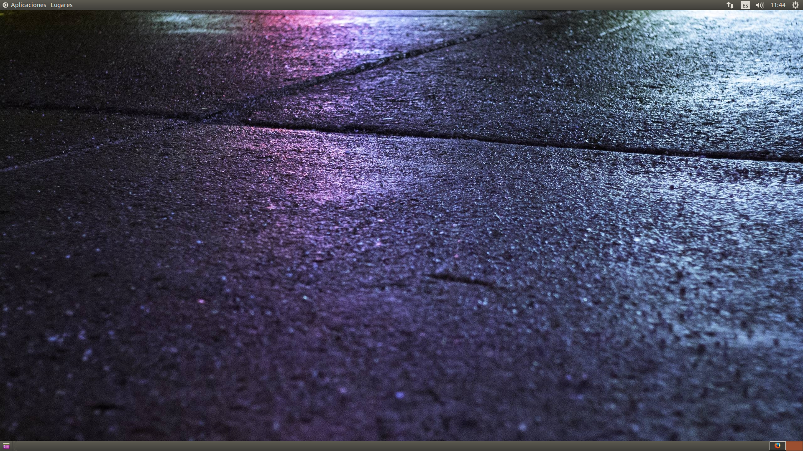
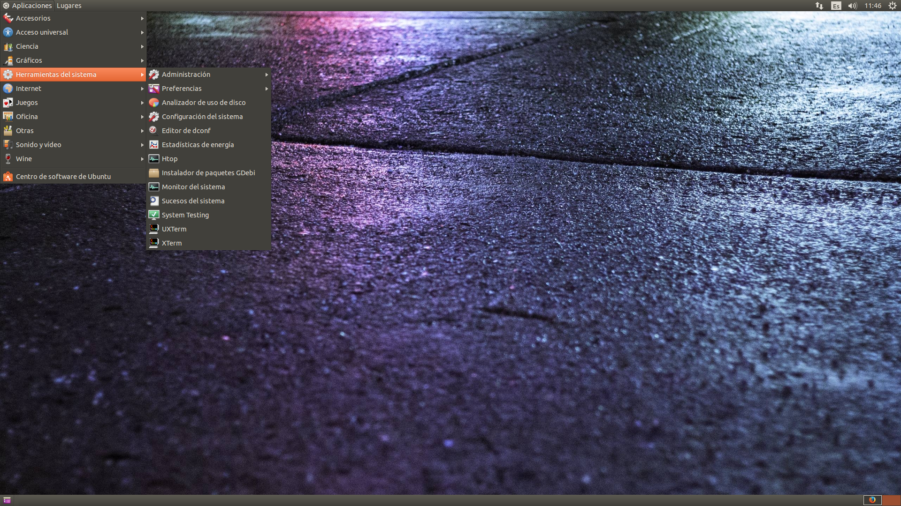
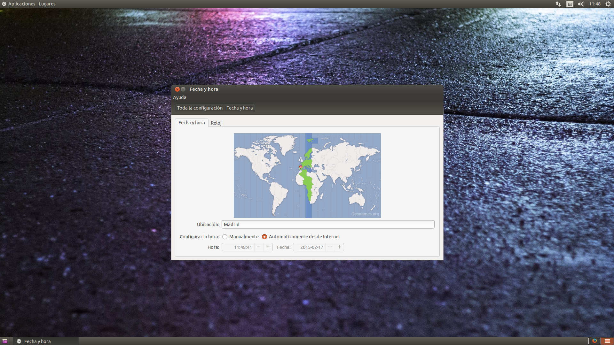
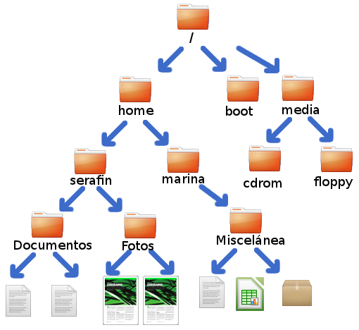
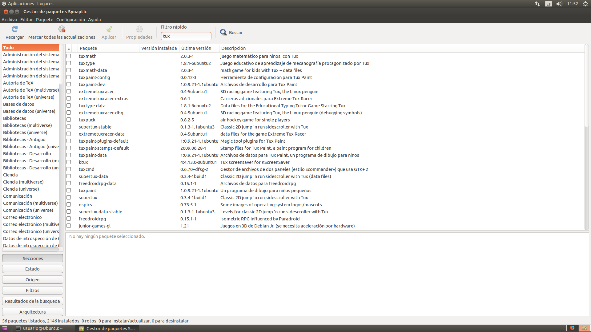
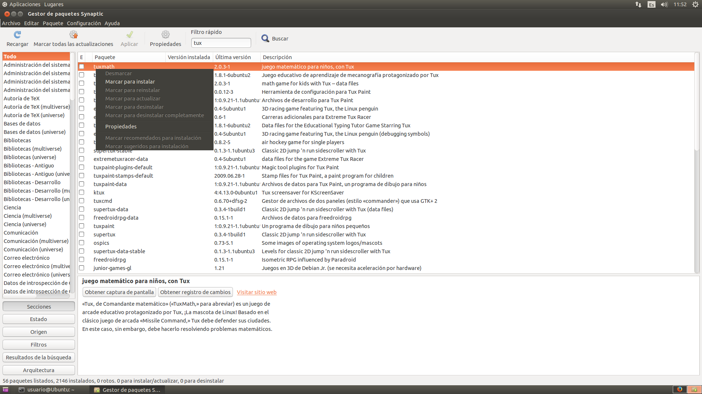
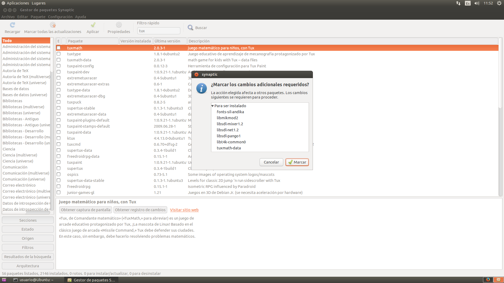
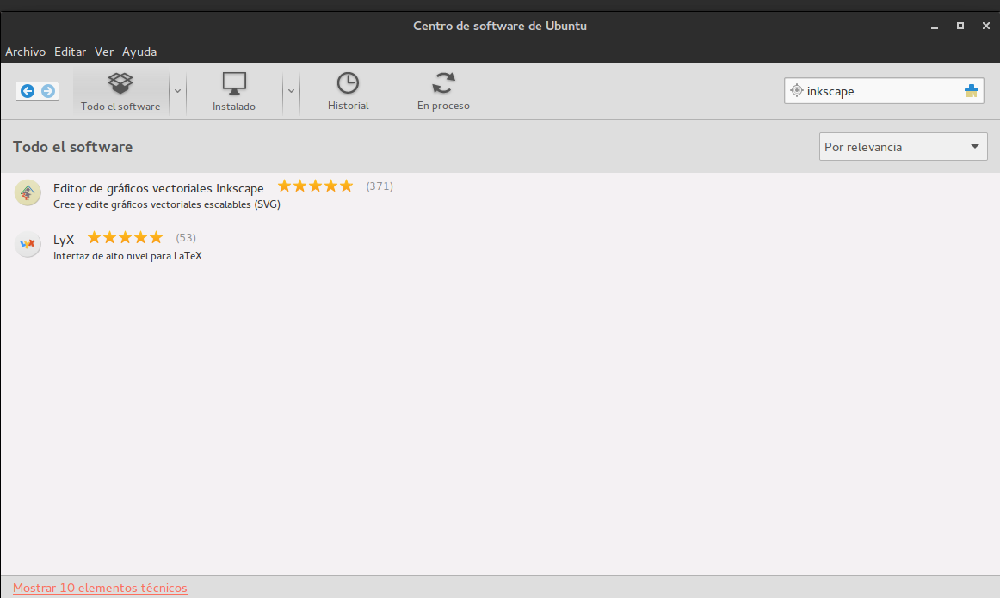

# XVI Campaña Ordenadores Libres con Software Libre: Manual de usuario

Esta obra está bajo una [licencia de Creative Commons Reconocimiento-NoComercial 4.0 Internacional](http://creativecommons.org/licenses/by-nc/4.0/).

* Manuel Cogolludo
* Renato Luis Rivero
* Jose Alonso Arias

### Índice

* [Iniciar el equipo](#2)
  * [Cuenta de usuario](#1_1)
  * [Poner en hora el equipo](#1_1)
* [Programas básicos instalados](#2)
  * [Firefox](#2_1)
  * [LibreOffice](#2_2)
  * [Gedit](#2_3)
  * [Gimp](#2_4)
  * [Vlc](#2_5)
  * [Tux Paint](#2_6)
* [Administración del sistema](#3)
  * [Sistema de archivos](#3_1)
* [Instalar programas](#4)
  * [Desde gestor de paquetes Synaptic](#4_1)
  * [Centro de Software de Ubuntu](#4_2)
* [Otras formas de instalar programas](#5)
  * [Descargando el paquete desde la página web de la aplicación](#5_1)
* [Sistema de archivos](#6)
* [Contacto](#7)

<h3 id="1">Iniciar el equipo</h3>  

Al arrancar el equipo deberá de aparecer una imagen de la Oficina de Software Libre con dos opciones de arranque.

> Para iniciar el sistema de forma normal seleccionamos la primera opción de las dos posibles.

Esta primera opción se seleccionará automáticamente al cabo de unos segundos si no pulsamos ninguna tecla.

*En caso de que no aparezca la imagen indicada, es posible que sea necesario pulsar la tecla F1. Deberemos de leer lo que se muestre por pantalla y seguir las instrucciones. Si no consigue arrancar el equipo, póngase en contacto con nosotros indicando el problema y el texto mostrado por pantalla (si toman una fotografía se lo agradeceríamos para solventar el problema).*

El escritorio será algo parecido a la siguiente imagen donde indicamos los elementos principales:

Un [sistema operativo](http://es.wikipedia.org/wiki/Sistema_operativo) es el conjunto de programas básicos y utilidades que hacen que funcione su equipo. El sistema operativo instalado es un [Ubuntu](https://es.wikipedia.org/wiki/Ubuntu) que es una versión de Linux.

Un [entorno de escritorio](http://es.wikipedia.org/wiki/Entorno_de_escritorio) por lo general consiste de iconos, ventanas, barras de herramientas, carpetas, fondos de pantalla y widgets de escritorio. El entorno instalado es [Gnome](http://www.gnome.org/), un entorno ligero que tiene como objetivo ser rápido y de bajos recursos del sistema, sin dejar de ser visualmente atractivo y fácil de usar.

<h4 id ="1_1"> Cuenta de usuario </h4>

Posteriormente, nos aparece una pantalla de fondo azul que nos pide un usuario y contraseña. Introducimos los siguientes datos:

> Usuario: invitado

> Contraseña: osloslugr

Es posible que el sistema tarde cierto tiempo en cargarse completamente.

<h4 id ="1_2">Poner en hora el equipo</h4>

Si la hora indicada en la derecha del panel inferior no es correcta deberá seguir los siguientes pasos para cambiarla.

Diríjase a:

> Aplicaciones / Herramientas del sistema / Preferencias / Configuración del sistema

Tal y como se muestra en la siguiente imagen:

Aparecerá una ventana en la que no se nos permitirá modificar nada. Para poder cambiar los valores tenemos que introducir la contraseña de superusuario (explicado en el apartado Administración del sistema / Cuenta de superusuario):
> Contraseña: osloslugr

Ahora podemos poner la hora y la fecha actuales. Si vuelve a pedir una contraseña se debe de introducir la de usuario, indicada en el recuadro anterior.

<h3 id="2">Programas básicos instalados</h3>

El equipo tiene instalados por defecto diversas aplicaciones libres que abarcan distintas necesidades a la hora de trabajar o de utilizar el ordenador. A continuación puede conocer mejor alguno de los más básicos y útiles.

<h4 id="2_1">Firefox</h4>

Firefox es uno de los navegadores que viene con el sistema operativo, su funcionalidad con este navegador es la de poder acceder a internet, además de poder abrir incluso ficheros de texto y más.

Para usar la aplicación diríjase a:

> Aplicaciones / Internet / Firefox

<h4 id="2_2">LibreOffice</h4>

Esta suite ofimática incluye una serie de aplicaciones tales como Writer, Impress, Draw, Calc y Base. Estas aplicaciones le permitirán trabajar con textos, presentaciones y hojas de cálculos entre otras.

Para usar la aplicación diríjase a:

> Aplicaciones / Oficina / LibreOffice Writer

Seleccione en este último lugar la aplicación que desee según quiera trabajar con textos (Writer), hojas de cálculo (Calc), presentaciones (Impress), dibujos (Draw) o bases de datos. Para más información, diríjase a los folletos formativos nº 5, 6, 7 proporcionados.

<h4 id="2_3">Gedit</h4>

Gedit es una aplicación que sirve para editar ficheros de texto plano. Con Gedit podemos crear desde simples documentos de texto sin ningún tipo de formato, redactar o tomar notas respecto de algo hasta poder editar archivos de páginas web o archivos pertenecientes a un programa.

Para usar la aplicación diríjase a:

> Aplicaciones / Accesorios / Gedit

<h4 id="2_4">Gimp</h4>

Gimp es un programa de dibujo a mano alzada y retoque fotográfico, libre, gratuito y similar al privativo Photoshop. Te permite trabajar con capas, rutas, canales, tiene muchas utilidades y herramientas: seleccionar áreas por geometría, color (varita mágica), forma (tijeras), capturar colorear, ampliar, reducir, rotar, deformar, medir distancias, mover, alinear, recortar, inclinar, perspectiva, volteo, texto personalizado, rellenar pintado, mezcla, degradados, mosaicos, pinceles, lápiz, rotulador, aerografo, goma, escritura estilo caligrafía (tinta), dibujo a mano alzada, clonado, saneado, enfoque, desenfoque, emborronar, quemar...

También incluye muchos filtros y efectos para aplicar a los dibujos. Como quitar ojos rojos en las fotografías, distorsiones, sombras, detectar bordes... Lee muchísimos formatos de archivos, entre ellos psd de Photoshop, y puede guardar tus creaciones en xcf (formato predefinido), png, jpg, gif, ico, bmp, y muchos otros.

Para usar la aplicación diríjase a:

> Aplicaciones / Gráficos / Programa de manipulación imágenes GNU

<h4 id="2_5">Vlc</h4>

Vlc es un programa para reproducir tanto música o vídeos en una gran cantidad de formatos distintos (mp3, avi, mkv, mp4, ogv, etc). También permite incorporar subtítulos con formato srt a un vídeo arrastrando directamente el archivo de subtítulos a la imagen del vídeo en reproducción.

Para usar la aplicación diríjase a:

> Aplicaciones / Sonido y vídeo / Reproductor multimedia VLC

Una vez abierto el programa, puede reproducir música o vídeo desde:

> Medio / Abrir archivo

Y seleccionar el archivo deseado. También puede crear una lista de reproducción con todos los archivos reproducibles de un directorio indicando *Abrir directorio* y seleccionando el directorio que contiene estos archivos.

*Otra posibilidad, es usar la aplicación directamente desde el archivo de vídeo o audio. Si este archivo tiene el icono correspondiente a Vlc, bastará con un doble click, en caso contrario, será necesario pulsar con el botón derecho del ratón y seleccionar Abrir con / Reproductor multimedia Vlc.*

<h4 id="2_6">Tux Paint</h4>

Esta herramienta permite realizar dibujos de forma sencilla y rápida, recortar  o modificar imágenes y otras utilidades normales de un programa de dibujo libre. Normalmente es utilizado por niños y niñas ya que la interfaz es muy intuitiva y permite la creación de dibujos de forma divertida.

Para usar la aplicación diríjase a:

> Aplicaciones / Educación / Tux Paint

De nuevo, tenemos la posibilidad de arrancar el programa a partir de una imagen que tengamos guardada. Para ello pinchamos con el botón derecho del ratón sobre la imagen que queremos abrir y seleccionamos *Abrir con / Tux Paint.*

<h3 id="3">Administración del sistema</h3>

<h4 id="3_1">Sistema de archivos</h4>

Los documentos personales se guardan por defecto en una carpeta llamada **home**. Se puede acceder a esta carpeta desde:

> Lugares / Carpetas

Dentro del sistema de carpetas nos podemos mover entrando a ellas de la misma forma que con el resto de sistemas operativos tanto Linux como Windows.

En la siguiente imagen se puede ver de forma gráfica lo explicado:

Como vemos la información se representa como si fuera un árbol invertido, donde la raíz del árbol es del directorio indicado por / y a su vez cuelgan más directorios indicados por los recuadros y los ficheros que podemos acceder.

Por ejemplo si accedemos a una foto llamada “osl.png” perteneciente al usuario “Serafín” el sistema operativo pasaría por la ruta de acceso:

> /home/serafin/Fotos/osl.png

Bien pues la carpeta personal del usuario “invitado” se encuentra en la ruta:

> /home/invitado/

<h3 id="4">Instalar programas</h3>

Cuando queremos instalar algún programa nuevo podemos hacerlo de muchas formas. A continuación vamos a explicar las tres más fáciles. Para todas ellas será necesario introducir la contraseña de superusuario ya que la instalación de programas es una tarea de administración que únicamente se puede hacer si se tienen privilegios de administrador.

Recordamos que la contraseña que hay que introducir es:

> Contraseña: osloslugr

<h4 id="4_1">Desde gestor de paquetes Synaptic</h4>

Esta aplicación, es una de las más usadas para instalar aplicaciones y es la que de hecho se recomienda para esta tarea. Nos iremos a:

> Aplicaciones / Herramientas del sistema / Administración / Gestor de paquetes Synaptic

En el panel izquierdo disponemos de las categorías de los programas para instalar, así que si seleccionamos una de ellas, se nos reflejará en el panel derecho el listado de aplicaciones relacionadas con esa categoría.

Para instalar una aplicación concreta, debemos tener seleccionada la opción de **Todo** y en el recuadro de búsqueda escribiremos el nombre de la aplicación a instalar, por ejemplo **Tuxy** conforme vayamos escribiendo el nombre del programa se irá actualizando el listado de programas que concuerdan con lo que tiene el recuadro de búsqueda. Una vez tengamos en el listado la aplicación que queremos, hacemos doble click en la entrada del programa para marcarlo para instalar, ya que podemos seleccionar varios programas para instalarlos todos.

Un programa a instalar es lógico que necesite de otros programas o librerías para que se pueda instalar así que si al querer instalar una aplicación esta requiere algo que no tengamos instalado, nos aparecerá una imagen indicando esta situación, así que haremos click en el botón de aceptar para indicar que esos programas también se tienen que instalar.

Por último para proceder a la instalación pincharemos en el botón de **Aplicar** confirmando los cambios que se van a hacer en el sistema y esperamos a que se termine de instalar lo que estuviera elegido.

Nos pedirá la contraseña de superusuario, así que se la proporcionamos y se nos ejecutará la aplicación, teniendo una interfaz parecida a la siguiente:

<h3 id="5">Centro Software de Ubuntu</h3>

<h4 id="5_1">Descargando el paquete desde la página web de la aplicación</h4>

Los paquetes son archivos acabados en **.deb** que al ejecutarlos instalan en nuestro ordenador el programa de forma automática. Muchas aplicaciones tienen en su web oficial un enlace de descarga del archivo **.deb**.

Para iniciar basta con hacer doble click sobre el archivo descargado y pulsar posteriormente el botón de instalar el paquete que hay en la ventana que aparece. Al ejecutar el paquete (el archivo **.deb**) nos pedirá la contraseña antes mencionada.

<h3 id="6">Sistema de archivos</h3>
Todo sistema operativo tiene lo que se llama el sistema de archivos (o sistema de ficheros), esta parte del sistema operativo estructura la información guardada en una unidad de almacenamiento (normalmente un disco duro de una computadora), que luego será representada ya sea textual o gráficamente utilizando un [gestor de archivos](http://es.wikipedia.org/wiki/Gestor_de_archivos). La mayoría de los [sistemas operativos](http://es.wikipedia.org/wiki/Sistemas_operativos) manejan su propio sistema de archivos.

Existen diversos tipos tales como ***ext2***, ***ext3***, ***ext4*** que son los tipos nativos de Linux o FAT, NTFS de Windows. Linux tiene su forma de estructurar la información, para ello usa un sistema de archivos ramificado para organizar la información y acceder a los datos, es decir, usamos un árbol para localizar los ficheros, haciendo una analogía digamos que es parecido a si nos subiéramos a un árbol y nos moviéramos por las ramas hasta llegar a las hojas.

<h3 id="7">Contacto</h3>
En caso de tener alguna pregunta sobre el funcionamiento de los equipos donados puede ponerse en contacto con la oficina de Software Libre:

> Blog de la OSL: [osl.ugr.es](http://osl.ugr.es/)

> Oficina: c/ Real de Cartuja nº 36-38

Con los directores de la Oficina de Software Libre:

> Juan Julián Merelo Guervós: [dirosl@ugr.es](mailto:dirosl@ugr.es)
> Nuria Rico Castro [subdireccionsl@ugr.es](mailto:subdireccionsl@ugr.es)
> Teléfono: 958243000 Extensión: 20207

O con los técnicos informáticos encargados de los equipos donados:

> Manuel Cogolludo Vallejo: [makovalibre@gmail.com](mailto:makovalibre@gmail.com)
> Renato Ramirez Rivera: [renatolrr@gmail.com](mailto:renatolrr@gmail.com)
> José Alonso Arias González [toblerone554@gmail.com](mailto:toblerone554@gmail.com)

Manual adaptado del original, realizado por Serafín y Marina.
